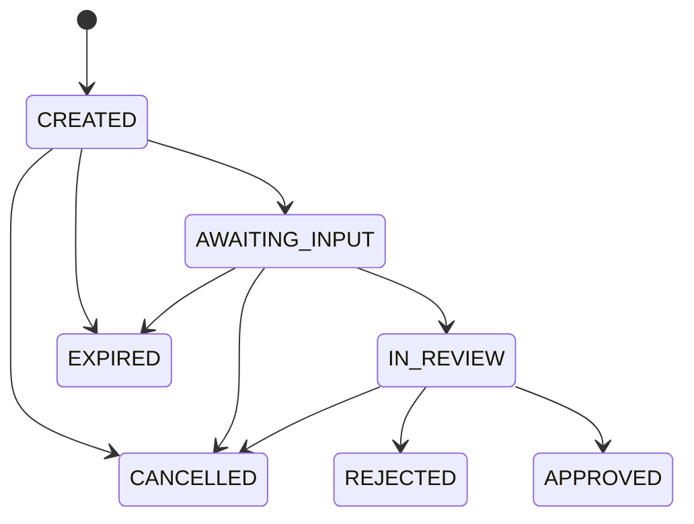

Merchant KYC lets you run identity verification on your own customers through the Blaaiz Platform API. You create a **verification session** for one person, collect what the session asks for, and Blaaiz returns the result on a webhook.

The product is separate from Blaaiz customer KYC. A verification session does not create a Blaaiz customer, a wallet, or a virtual bank account. You link the session to your own records with the `customer_reference` field.

<Note>
  Merchant KYC must be enabled for your business before you can create a
  session. Contact your account manager or [support@blaaiz.com](mailto:support@blaaiz.com)
  to request access.
</Note>

## Access and scopes

Merchant KYC uses the same OAuth client credentials as the rest of the Platform API. See [Authentication](/guides/authentication) for the token request.

Three scopes control the endpoints:

| Scope | Endpoints |
| --- | --- |
| `compliance-kyc:read` | List sessions, get one session |
| `compliance-kyc:create` | Create a session, upload documents, get an upload URL, issue a capture link, submit a session |
| `compliance-kyc:cancel` | Cancel a session |

The cancel action has its own scope because it is the one destructive action in the product. Request the scopes you need in the `scope` parameter of your token request.

The read and cancel endpoints stay available even when Merchant KYC is disabled for your business. You can always look up and cancel the sessions you already opened.

## Fulfilment modes

Every session has a `fulfilment_mode`. The mode says who collects the input from the person you verify.

| `fulfilment_mode` | Who collects the input | How you start it |
| --- | --- | --- |
| `BLAAIZ_HOSTED` | A Blaaiz capture page, at `verify.blaaiz.com` in production. The person uploads the documents and does the selfie there. | Issue a capture link and send it to the person. |
| `SUMSUB_HOSTED` | A verification page hosted by the Blaaiz verification partner. | Send the person the `verification_link` that the create response returns. |
| `HEADLESS` | Your own server. You upload the document images through the API. | Upload the documents, then submit the session. |

If you omit `fulfilment_mode` on create, Blaaiz uses the default mode for the requirement set you asked for.

## Requirements

The `requirements` array says what the session must prove. The order does not matter, and Blaaiz stores one canonical order.

| Requirement | What it proves |
| --- | --- |
| `DOCUMENTS` | The identity document is genuine. |
| `SELFIE` | A live person is present at capture time. |
| `FACE_MATCH` | The face on the selfie and the face on the document are the same person. |

`FACE_MATCH` is a separate requirement, not a side effect of `SELFIE`. A genuine document and a live person prove nothing on their own until a check confirms that they belong together. Because that check needs both faces, `FACE_MATCH` needs `DOCUMENTS` and `SELFIE` in the same set.

### Supported combinations

Blaaiz supports the combinations in the table below. If you ask for any other combination, the create call fails with `422` and the message names the supported sets.

| `requirements` | `fulfilment_mode` | Default for the set |
| --- | --- | --- |
| `["DOCUMENTS", "SELFIE", "FACE_MATCH"]` | `SUMSUB_HOSTED` | Yes |
| `["DOCUMENTS", "SELFIE", "FACE_MATCH"]` | `BLAAIZ_HOSTED` | No |
| `["DOCUMENTS"]` | `HEADLESS` | Yes |

The API reference lists `PROOF_OF_ADDRESS` as a fourth accepted value of `requirements`. No supported combination includes it today, so a session that asks for it fails with `422`.

<Note>
  A documents-only set is never hosted, and a set with `SELFIE` is never
  headless. The selfie proves that a live person is present, so Blaaiz must
  capture it. A session that includes `SELFIE` rejects a `SELFIE` document
  upload from your server.
</Note>

## Session lifecycle



| `status` | Meaning | Terminal |
| --- | --- | --- |
| `CREATED` | Blaaiz created the session but it does not accept input yet. | No |
| `AWAITING_INPUT` | The session accepts documents, a selfie, or both. | No |
| `IN_REVIEW` | The session went to review. It accepts no more input. | No |
| `APPROVED` | The checks passed. | Yes |
| `REJECTED` | The checks failed. Read the `rejection` object. | Yes |
| `EXPIRED` | The session passed its `expires_at` deadline before it completed. | Yes |
| `CANCELLED` | You cancelled the session. | Yes |

A create call normally returns `AWAITING_INPUT`. `CREATED` means that Blaaiz did not finish the setup of the session. Repeat the create call with the same `idempotency_key` to finish it.

Terminal is final. After a session is terminal, Blaaiz sends no more webhooks for it and accepts no more input.

### Steps

The `steps` object shows what is still outstanding while the session is `AWAITING_INPUT`.

| Field | Values | Notes |
| --- | --- | --- |
| `steps.documents` | `PENDING`, `SUBMITTED` | Always present. |
| `steps.selfie` | `PENDING`, `SUBMITTED`, `null` | `null` when the requirement set has no `SELFIE`. |

### Rejections

When `status` is `REJECTED`, the `rejection` object holds the outcome. For every other status, `rejection` is `null`.

| Field | Description |
| --- | --- |
| `rejection.reason` | Text you can show to the person. It can be `null`. |
| `rejection.type` | `FINAL` or `RETRYABLE`. |

| `rejection.type` | What to do |
| --- | --- |
| `RETRYABLE` | The person can try again. Create a new session and collect fresh input. |
| `FINAL` | Do not retry. The verification failed for good. |

<Note>
  A session is never reopened. Both rejection types need a new session for
  another attempt. The type tells you whether another attempt is worth it.
</Note>

## Idempotency

`idempotency_key` is required on create. Blaaiz stores it against your business, so your keys never collide with another merchant's keys.

- If you repeat a create call with a key you already used, Blaaiz returns the stored session. It does not create a second session.
- If you repeat the key with a different `customer_reference` or a different requirement set, the call fails with `422`.
- Keys are never released. An expired or cancelled session keeps its key for good.

Use one key per person you verify, and store it with your own record of that person.

## Session expiry

Every session carries an `expires_at` timestamp. Blaaiz expires a session that is still `CREATED` or `AWAITING_INPUT` at that deadline. A session that reached `IN_REVIEW` does not expire.

Read `expires_at` from the create response. Do not calculate the deadline yourself.

## Open session limits

Blaaiz caps how many open sessions one business can hold. A session counts as open while its status is `CREATED`, `AWAITING_INPUT`, or `IN_REVIEW`.

When you reach the cap, a create call fails with `422` and this message:

```
Too many open verification sessions; complete, cancel, or let existing sessions expire.
```

To stay under the cap, cancel the sessions you no longer need. If your volume needs a higher cap, contact [support@blaaiz.com](mailto:support@blaaiz.com).

## Next steps

<CardGroup cols={2}>
  <Card title="Blaaiz-hosted quickstart" icon="link" href="/compliance/quickstart-hosted">
    Create a session, send a capture link, and get the result on your webhook.
  </Card>
  <Card title="Headless quickstart" icon="upload" href="/compliance/quickstart-headless">
    Upload document images from your server and submit the session for review.
  </Card>
  <Card title="Webhooks" icon="bell" href="/compliance/webhooks">
    Register your `kyc_url` and verify the `x-blaaiz-signature` header.
  </Card>
  <Card title="API reference" icon="code" href="/api-reference/compliance-kyc/create-session-openapi.json">
    All eight verification session endpoints.
  </Card>
</CardGroup>
