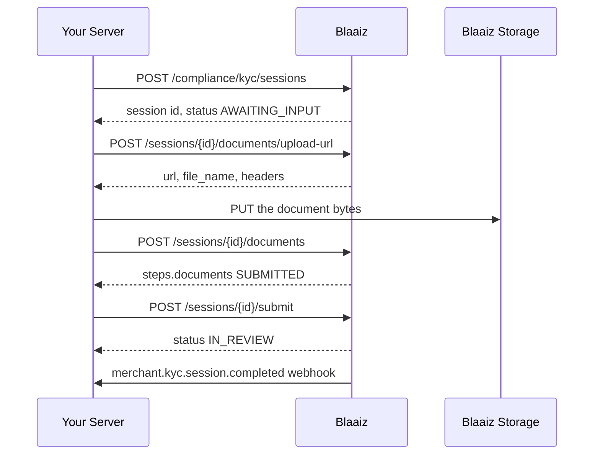

This quickstart uses the `HEADLESS` fulfilment mode. You already hold the document images, so you upload them from your server. Blaaiz never contacts the person you verify.

A headless session asks for `DOCUMENTS` only. If you need a live selfie, use the [Blaaiz-hosted quickstart](/compliance/quickstart-hosted) instead. Read [Merchant KYC overview](/compliance/overview) first for the session model.

## Before you start

- Merchant KYC must be enabled for your business.
- Your OAuth credentials must carry the `compliance-kyc:create` and `compliance-kyc:read` scopes.
- Your `kyc_url` webhook must be registered. See [Merchant KYC webhooks](/compliance/webhooks).

The examples use the production base URL `https://api-prod.blaaiz.com`. For development, use `https://api-dev.blaaiz.com`.

## Flow



## Step 1: Create the session

```bash
curl -X POST https://api-prod.blaaiz.com/api/external/compliance/kyc/sessions \
  -H "Authorization: Bearer YOUR_ACCESS_TOKEN" \
  -H "Content-Type: application/json" \
  -d '{
    "customer_reference": "user_10482",
    "idempotency_key": "kyc-user_10482-2026-08-29",
    "requirements": ["DOCUMENTS"],
    "applicant": {
      "first_name": "Amara",
      "last_name": "Okafor",
      "dob": "1993-04-17",
      "country": "NGA"
    }
  }'
```

`HEADLESS` is the default mode for a `["DOCUMENTS"]` set, so you can omit `fulfilment_mode`. Send `"fulfilment_mode": "HEADLESS"` if you prefer to be explicit.

```json
{
  "message": "Verification session created successfully.",
  "data": {
    "id": "9f2c7b41-6d3e-4c8a-9a20-1e6f0b5d7c33",
    "business_id": "9d4c4ec5-572d-49de-a362-f01ed09f2b1b",
    "customer_reference": "user_10482",
    "requirements": ["DOCUMENTS"],
    "fulfilment_mode": "HEADLESS",
    "status": "AWAITING_INPUT",
    "steps": {
      "documents": "PENDING",
      "selfie": null
    },
    "rejection": null,
    "expires_at": "2026-08-30T09:14:22.000Z",
    "completed_at": null,
    "created_at": "2026-08-29T09:14:22.000Z",
    "verification_link": null,
    "link_expires_at": null
  }
}
```

`steps.selfie` is `null` because the requirement set has no `SELFIE`.

The session must be `AWAITING_INPUT` before it accepts a document. If `status` is `CREATED`, repeat the create call with the same `idempotency_key`.

## Step 2: Get an upload URL

<Warning>
  Do not send document bytes in the request body. A request body larger than
  about 8 KB is rejected at the network edge, before the API sees it. Use the
  upload URL for every real document.
</Warning>

```bash
curl -X POST https://api-prod.blaaiz.com/api/external/compliance/kyc/sessions/9f2c7b41-6d3e-4c8a-9a20-1e6f0b5d7c33/documents/upload-url \
  -H "Authorization: Bearer YOUR_ACCESS_TOKEN" \
  -H "Content-Type: application/json" \
  -d '{
    "file_name": "passport front.jpg",
    "id_doc_type": "PASSPORT"
  }'
```

```json
{
  "message": "Verification session document upload URL generated successfully.",
  "data": {
    "url": "https://blaaiz-compliance-prod-storage.s3.eu-west-1.amazonaws.com/merchant-kyc/9d4c4ec5/9f2c7b41/4a7f1c92e0_passport%20front.jpg?X-Amz-Algorithm=AWS4-HMAC-SHA256&X-Amz-Expires=300&X-Amz-Signature=EXAMPLE",
    "file_name": "4a7f1c92e0_passport front.jpg",
    "headers": {}
  }
}
```

| Field | Description |
| --- | --- |
| `url` | The presigned URL you upload the bytes to. It is valid for 5 minutes. |
| `file_name` | The name Blaaiz gave the staged file. Send this exact value in step 4. |
| `headers` | Headers you must send with the upload. The object can be empty. |

Your `file_name` must use letters, numbers, spaces, dashes, or underscores, and must end in `.jpg`, `.jpeg`, `.png`, `.webp`, or `.pdf`. Blaaiz adds a random prefix and returns the result in `data.file_name`.

## Step 3: Upload the bytes

Send the file to the `url` with an HTTP `PUT`. Add every header from the `headers` object.

```bash
curl -X PUT "PRESIGNED_URL_FROM_STEP_2" \
  --upload-file ./passport-front.jpg
```

A staged file must be 5 MB or smaller. Blaaiz rejects a larger file when you register it in step 4.

## Step 4: Register the document

This call tells Blaaiz which staged file belongs to the session, and what the file is.

```bash
curl -X POST https://api-prod.blaaiz.com/api/external/compliance/kyc/sessions/9f2c7b41-6d3e-4c8a-9a20-1e6f0b5d7c33/documents \
  -H "Authorization: Bearer YOUR_ACCESS_TOKEN" \
  -H "Content-Type: application/json" \
  -d '{
    "filename": "passport-front.jpg",
    "content_type": "image/jpeg",
    "id_doc_type": "PASSPORT",
    "country": "NGA",
    "file_name": "4a7f1c92e0_passport front.jpg"
  }'
```

| Field | Description |
| --- | --- |
| `filename` | The name Blaaiz stores the document under. |
| `content_type` | One of `image/jpeg`, `image/png`, `image/webp`, `application/pdf`. |
| `id_doc_type` | One of `PASSPORT`, `ID_CARD`, `DRIVERS`, `RESIDENCE_PERMIT`, `UTILITY_BILL`, `SELFIE`. |
| `country` | The country of the document, as an ISO 3166-1 alpha-3 code. |
| `file_name` | The `data.file_name` value from step 2. |

The response is the session, with `steps.documents` set to `SUBMITTED`:

```json
{
  "message": "Verification session document uploaded successfully.",
  "data": {
    "id": "9f2c7b41-6d3e-4c8a-9a20-1e6f0b5d7c33",
    "business_id": "9d4c4ec5-572d-49de-a362-f01ed09f2b1b",
    "customer_reference": "user_10482",
    "requirements": ["DOCUMENTS"],
    "fulfilment_mode": "HEADLESS",
    "status": "AWAITING_INPUT",
    "steps": {
      "documents": "SUBMITTED",
      "selfie": null
    },
    "rejection": null,
    "expires_at": "2026-08-30T09:14:22.000Z",
    "completed_at": null,
    "created_at": "2026-08-29T09:14:22.000Z"
  }
}
```

To send more than one document, repeat steps 2 to 4 for each file. Give each file its own `id_doc_type`.

### Small files

A document under about 8 KB can travel in the request body. Replace `file_name` with `content_base64` and send the base64 of the file. Send one of the two fields, never both.

```json
{
  "filename": "passport-front.jpg",
  "content_type": "image/jpeg",
  "id_doc_type": "PASSPORT",
  "country": "NGA",
  "content_base64": "/9j/4AAQSkZJRgABAQAAAQABAAD..."
}
```

Real identity documents are larger than the edge limit. Use the upload URL for them.

## Step 5: Submit the session for review

```bash
curl -X POST https://api-prod.blaaiz.com/api/external/compliance/kyc/sessions/9f2c7b41-6d3e-4c8a-9a20-1e6f0b5d7c33/submit \
  -H "Authorization: Bearer YOUR_ACCESS_TOKEN"
```

The session moves to `IN_REVIEW`:

```json
{
  "message": "Verification session submitted successfully.",
  "data": {
    "id": "9f2c7b41-6d3e-4c8a-9a20-1e6f0b5d7c33",
    "business_id": "9d4c4ec5-572d-49de-a362-f01ed09f2b1b",
    "customer_reference": "user_10482",
    "requirements": ["DOCUMENTS"],
    "fulfilment_mode": "HEADLESS",
    "status": "IN_REVIEW",
    "steps": {
      "documents": "SUBMITTED",
      "selfie": null
    },
    "rejection": null,
    "expires_at": "2026-08-30T09:14:22.000Z",
    "completed_at": null,
    "created_at": "2026-08-29T09:14:22.000Z"
  }
}
```

Blaaiz refuses the submit in three cases:

- The documents step is still `PENDING`. Upload a document first.
- The session already left `AWAITING_INPUT`. You cannot submit twice.
- The session is `SUMSUB_HOSTED`. The person submits that session on the verification link.

An `IN_REVIEW` session no longer expires, and it accepts no more documents.

## Step 6: Wait for the webhook

```json
{
  "event": "merchant.kyc.session.completed",
  "data": {
    "session_id": "9f2c7b41-6d3e-4c8a-9a20-1e6f0b5d7c33",
    "business_id": "9d4c4ec5-572d-49de-a362-f01ed09f2b1b",
    "customer_reference": "user_10482",
    "requirements": ["DOCUMENTS"],
    "result": "REJECTED",
    "rejection_reason": "The document image is too blurred to read.",
    "rejection_type": "RETRYABLE",
    "completed_at": "2026-08-29T09:48:11.000Z"
  }
}
```

A `RETRYABLE` rejection means the person can try again. Create a new session with a new `idempotency_key` and upload clearer images. A `FINAL` rejection means you must not retry.

Verify the `x-blaaiz-signature` header before you trust the payload. See [Merchant KYC webhooks](/compliance/webhooks).
