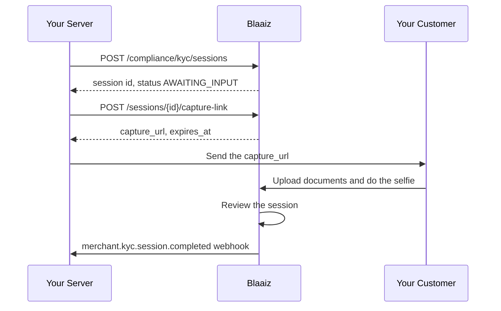

This quickstart uses the `BLAAIZ_HOSTED` fulfilment mode. Your customer opens a Blaaiz page, uploads the identity document, and does the selfie there. You write no capture code.

Read [Merchant KYC overview](/compliance/overview) first for the session model.

## Before you start

- Merchant KYC must be enabled for your business.
- Your OAuth credentials must carry the `compliance-kyc:create` and `compliance-kyc:read` scopes.
- Your `kyc_url` webhook must be registered. See [Merchant KYC webhooks](/compliance/webhooks).

The examples use the production base URL `https://api-prod.blaaiz.com`. For development, use `https://api-dev.blaaiz.com`.

## Flow



## Step 1: Get an access token

```bash
curl -X POST https://api-prod.blaaiz.com/oauth/token \
  -H "Content-Type: application/x-www-form-urlencoded" \
  --data-urlencode "grant_type=client_credentials" \
  --data-urlencode "client_id=YOUR_CLIENT_ID" \
  --data-urlencode "client_secret=YOUR_CLIENT_SECRET" \
  --data-urlencode "scope=compliance-kyc:create compliance-kyc:read"
```

## Step 2: Create the session

Ask for the full set — `DOCUMENTS`, `SELFIE`, and `FACE_MATCH` — and set `fulfilment_mode` to `BLAAIZ_HOSTED`.

The `applicant` object is optional. Send the details you already hold so that the person types less on the capture page.

```bash
curl -X POST https://api-prod.blaaiz.com/api/external/compliance/kyc/sessions \
  -H "Authorization: Bearer YOUR_ACCESS_TOKEN" \
  -H "Content-Type: application/json" \
  -d '{
    "customer_reference": "user_10482",
    "idempotency_key": "kyc-user_10482-2026-08-29",
    "requirements": ["DOCUMENTS", "SELFIE", "FACE_MATCH"],
    "fulfilment_mode": "BLAAIZ_HOSTED",
    "applicant": {
      "first_name": "Amara",
      "last_name": "Okafor",
      "dob": "1993-04-17",
      "country": "NGA"
    }
  }'
```

The response returns the session:

```json
{
  "message": "Verification session created successfully.",
  "data": {
    "id": "9f2c7b41-6d3e-4c8a-9a20-1e6f0b5d7c33",
    "business_id": "9d4c4ec5-572d-49de-a362-f01ed09f2b1b",
    "customer_reference": "user_10482",
    "requirements": ["DOCUMENTS", "SELFIE", "FACE_MATCH"],
    "fulfilment_mode": "BLAAIZ_HOSTED",
    "status": "AWAITING_INPUT",
    "steps": {
      "documents": "PENDING",
      "selfie": "PENDING"
    },
    "rejection": null,
    "expires_at": "2026-08-30T09:14:22.000Z",
    "completed_at": null,
    "created_at": "2026-08-29T09:14:22.000Z",
    "verification_link": null,
    "link_expires_at": null
  }
}
```

Store `data.id` against your own record for `user_10482`. You need the session id for every later call.

<Note>
  `verification_link` and `link_expires_at` are always `null` for a
  `BLAAIZ_HOSTED` session. The capture link comes from the endpoint in step 3.
</Note>

`applicant.country` uses the three-letter ISO 3166-1 alpha-3 code, such as `NGA` or `CAN`.

## Step 3: Issue the capture link

```bash
curl -X POST https://api-prod.blaaiz.com/api/external/compliance/kyc/sessions/9f2c7b41-6d3e-4c8a-9a20-1e6f0b5d7c33/capture-link \
  -H "Authorization: Bearer YOUR_ACCESS_TOKEN"
```

```json
{
  "message": "Capture link issued successfully.",
  "data": {
    "capture_url": "https://verify.blaaiz.com/c/8Kq2rV5wZs1tYb7NfPjX0aLmC4hD6gEuR9oT3nQiWxs",
    "expires_at": "2026-08-29T09:44:22.000Z"
  }
}
```

The link is valid for 30 minutes. Use the `capture_url` value exactly as it is returned. The host is different in development, so do not build the URL yourself.

<Warning>
  The `capture_url` is a live credential for one session. Anybody who holds it
  can submit the verification. Send it over a private channel, and keep it out
  of your logs.
</Warning>

## Step 4: Send the link to your customer

Send the `capture_url` to the person by email, SMS, or in your own app. The page asks the person to upload the identity document and to do the selfie.

If the link expires before the person opens it, call the capture-link endpoint again. Blaaiz issues a new link and the old link stops working at that moment. Use the same call when a link leaks.

The capture-link endpoint fails when the session is terminal, and when the requirement set has no `SELFIE`.

## Step 5: Wait for the webhook

When the review completes, Blaaiz posts `merchant.kyc.session.completed` to your `kyc_url`:

```json
{
  "event": "merchant.kyc.session.completed",
  "data": {
    "session_id": "9f2c7b41-6d3e-4c8a-9a20-1e6f0b5d7c33",
    "business_id": "9d4c4ec5-572d-49de-a362-f01ed09f2b1b",
    "customer_reference": "user_10482",
    "requirements": ["DOCUMENTS", "SELFIE", "FACE_MATCH"],
    "result": "APPROVED",
    "rejection_reason": null,
    "rejection_type": null,
    "completed_at": "2026-08-29T09:31:05.000Z"
  }
}
```

Verify the `x-blaaiz-signature` header before you trust the payload. See [Merchant KYC webhooks](/compliance/webhooks).

## Check the status at any time

You do not have to wait for the webhook to read the state of a session:

```bash
curl -X GET https://api-prod.blaaiz.com/api/external/compliance/kyc/sessions/9f2c7b41-6d3e-4c8a-9a20-1e6f0b5d7c33 \
  -H "Authorization: Bearer YOUR_ACCESS_TOKEN"
```

Use the webhook as the trigger for your own work. Use the read endpoints to reconcile.

## Cancel a session

If the person abandons the flow, cancel the session. A cancel frees a slot under your open-session cap and kills the capture link. This call needs the `compliance-kyc:cancel` scope.

```bash
curl -X POST https://api-prod.blaaiz.com/api/external/compliance/kyc/sessions/9f2c7b41-6d3e-4c8a-9a20-1e6f0b5d7c33/cancel \
  -H "Authorization: Bearer YOUR_ACCESS_TOKEN"
```

A cancel on a session that is already terminal succeeds and changes nothing.

<Note>
  Do not call the submit endpoint for a hosted session. The person submits the
  session on the capture page.
</Note>
