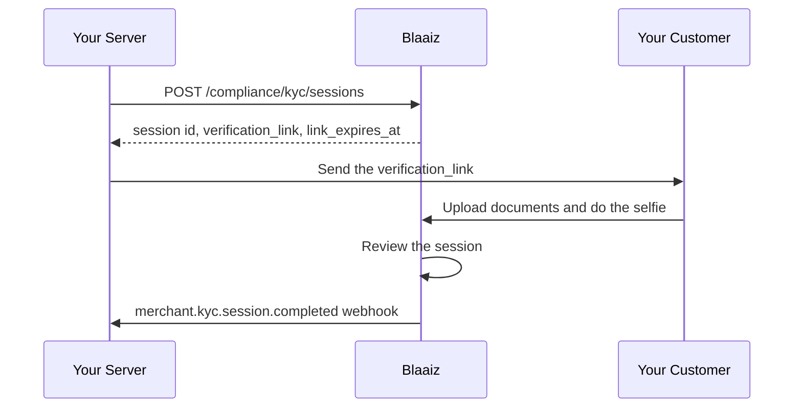

This quickstart uses the `HOSTED` fulfilment mode. Your customer opens a verification page, uploads the identity document, and does the selfie there. You write no capture code.

Blaaiz hosts that page, or the Blaaiz verification partner hosts it. Blaaiz makes that choice for your business. Your integration is the same either way: send the person the `verification_link` from the create response.

The page also collects the proof of address when the session asks for it. The page shows one step for each requirement in the set, and nothing more.

Read [Merchant KYC overview](/compliance/overview) first for the session model.

## Before you start

- Merchant KYC must be enabled for your business.
- Your OAuth credentials must carry the `compliance-kyc:create` and `compliance-kyc:read` scopes.
- Your `kyc_url` webhook must be registered. See [Merchant KYC webhooks](/compliance/webhooks).

The examples use the production base URL `https://api-prod.blaaiz.com`. For development, use `https://api-dev.blaaiz.com`.

## Flow



## Step 1: Get an access token

```bash
curl -X POST https://api-prod.blaaiz.com/oauth/token \
  -H "Content-Type: application/x-www-form-urlencoded" \
  --data-urlencode "grant_type=client_credentials" \
  --data-urlencode "client_id=YOUR_CLIENT_ID" \
  --data-urlencode "client_secret=YOUR_CLIENT_SECRET" \
  --data-urlencode "scope=compliance-kyc:create compliance-kyc:read"
```

## Step 2: Create the session

Ask for the full set — `DOCUMENTS`, `SELFIE`, and `FACE_MATCH` — and set `fulfilment_mode` to `HOSTED`. To collect the proof of address on the same page, add `PROOF_OF_ADDRESS` to `requirements`.

The `applicant` object is optional. Send the details you already hold so that the person types less on the verification page.

```bash
curl -X POST https://api-prod.blaaiz.com/api/external/compliance/kyc/sessions \
  -H "Authorization: Bearer YOUR_ACCESS_TOKEN" \
  -H "Content-Type: application/json" \
  -d '{
    "customer_reference": "user_10482",
    "idempotency_key": "kyc-user_10482-2026-08-29",
    "requirements": ["DOCUMENTS", "SELFIE", "FACE_MATCH"],
    "fulfilment_mode": "HOSTED",
    "applicant": {
      "first_name": "Amara",
      "last_name": "Okafor",
      "dob": "1993-04-17",
      "country": "NGA"
    }
  }'
```

The response returns the session:

```json
{
  "message": "Verification session created successfully.",
  "data": {
    "id": "9f2c7b41-6d3e-4c8a-9a20-1e6f0b5d7c33",
    "business_id": "9d4c4ec5-572d-49de-a362-f01ed09f2b1b",
    "customer_reference": "user_10482",
    "requirements": ["DOCUMENTS", "SELFIE", "FACE_MATCH"],
    "fulfilment_mode": "HOSTED",
    "status": "AWAITING_INPUT",
    "steps": {
      "documents": "PENDING",
      "selfie": "PENDING",
      "proof_of_address": null
    },
    "rejection": null,
    "expires_at": "2026-08-30T09:14:22.000Z",
    "completed_at": null,
    "created_at": "2026-08-29T09:14:22.000Z",
    "verification_link": "https://verify.blaaiz.com/c/8Kq2rV5wZs1tYb7NfPjX0aLmC4hD6gEuR9oT3nQiWxs",
    "link_expires_at": "2026-08-29T09:44:22.000Z"
  }
}
```

Store `data.id` against your own record for `user_10482`. You need the session id for every later call.

Read `data.verification_link` and `data.link_expires_at` from this response. A `HOSTED` session always carries both. Use the `verification_link` value exactly as it is returned. The host differs between environments, so do not build the URL yourself.

<Note>
  `verification_link` comes back on the create call only. The read endpoints
  never return it. Store it, or issue a new link with the endpoint in the
  section "Issue a new verification link".
</Note>

`applicant.country` uses the three-letter ISO 3166-1 alpha-3 code, such as `NGA` or `CAN`.

## Step 3: Send the link to your customer

Send the `verification_link` to the person by email, SMS, or in your own app. The page asks the person for each step of the set in turn.

| Step | What the page asks for |
| --- | --- |
| Documents | A photo of the identity document. |
| Proof of address | The document type, the country of the address on the document, and a photo or a PDF. |
| Selfie | A live face capture. |

<Warning>
  The `verification_link` is a live credential for one session. Anybody who
  holds it can submit the verification. Send it over a private channel, and
  keep it out of your logs.
</Warning>

## Step 4: Wait for the webhook

When the review completes, Blaaiz posts `merchant.kyc.session.completed` to your `kyc_url`:

```json
{
  "event": "merchant.kyc.session.completed",
  "data": {
    "session_id": "9f2c7b41-6d3e-4c8a-9a20-1e6f0b5d7c33",
    "business_id": "9d4c4ec5-572d-49de-a362-f01ed09f2b1b",
    "customer_reference": "user_10482",
    "requirements": ["DOCUMENTS", "SELFIE", "FACE_MATCH"],
    "result": "APPROVED",
    "rejection_reason": null,
    "rejection_type": null,
    "completed_at": "2026-08-29T09:31:05.000Z"
  }
}
```

Verify the `x-blaaiz-signature` header before you trust the payload. See [Merchant KYC webhooks](/compliance/webhooks).

## Issue a new verification link

The link stops working at `link_expires_at`. If the link expires before the person opens it, issue a new one. Use the same call when a link leaks.

```bash
curl -X POST https://api-prod.blaaiz.com/api/external/compliance/kyc/sessions/9f2c7b41-6d3e-4c8a-9a20-1e6f0b5d7c33/verification-link \
  -H "Authorization: Bearer YOUR_ACCESS_TOKEN"
```

```json
{
  "message": "Verification link issued successfully.",
  "data": {
    "verification_link": "https://verify.blaaiz.com/c/2Wd8sQ6pL4vXz0KbRm9TyH3uJ7cNfA1gE5oV2iBqZxs",
    "link_expires_at": "2026-08-29T10:12:40.000Z"
  }
}
```

Send the new link to the person. The previous link may stop working as soon as Blaaiz issues a new one, so treat the newest link as the only valid one.

This endpoint works for every `HOSTED` session, including a session with no selfie step. Blaaiz refuses the call when the session is terminal, and when the session is `HEADLESS`.

## Check the status at any time

You do not have to wait for the webhook to read the state of a session:

```bash
curl -X GET https://api-prod.blaaiz.com/api/external/compliance/kyc/sessions/9f2c7b41-6d3e-4c8a-9a20-1e6f0b5d7c33 \
  -H "Authorization: Bearer YOUR_ACCESS_TOKEN"
```

Use the webhook as the trigger for your own work. Use the read endpoints to reconcile.

## Cancel a session

If the person abandons the flow, cancel the session. A cancel frees a slot under your open-session cap and kills the verification link. This call needs the `compliance-kyc:cancel` scope.

```bash
curl -X POST https://api-prod.blaaiz.com/api/external/compliance/kyc/sessions/9f2c7b41-6d3e-4c8a-9a20-1e6f0b5d7c33/cancel \
  -H "Authorization: Bearer YOUR_ACCESS_TOKEN"
```

A cancel on a session that is already terminal succeeds and changes nothing.

<Note>
  Do not upload documents and do not call the submit endpoint for a `HOSTED`
  session. The document endpoints and the submit endpoint answer a `HOSTED`
  session with `422` and this message:

  ```
  This session is completed by the end customer on the verification link. Send the customer the verification_link, or call POST /sessions/{id}/verification-link to issue a new one.
  ```
</Note>
