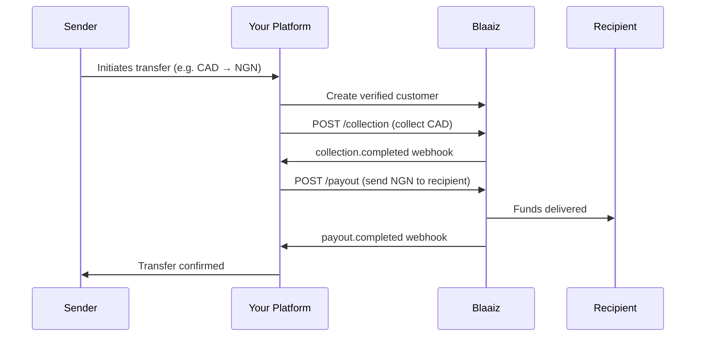
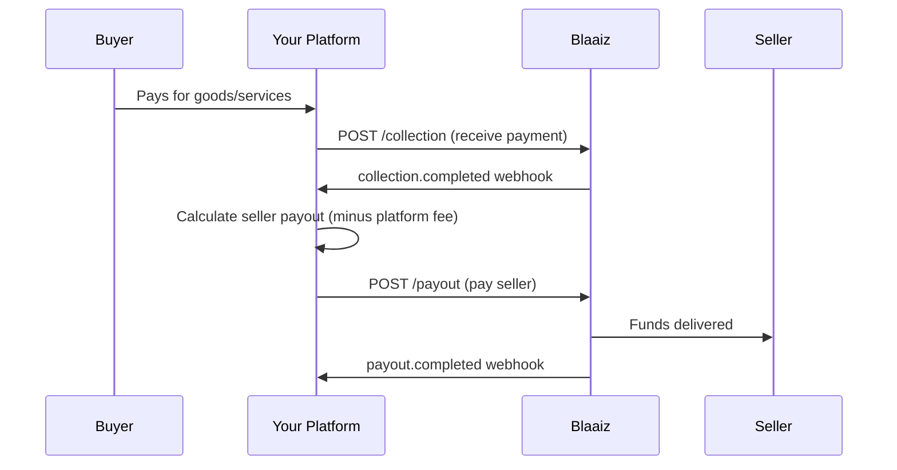
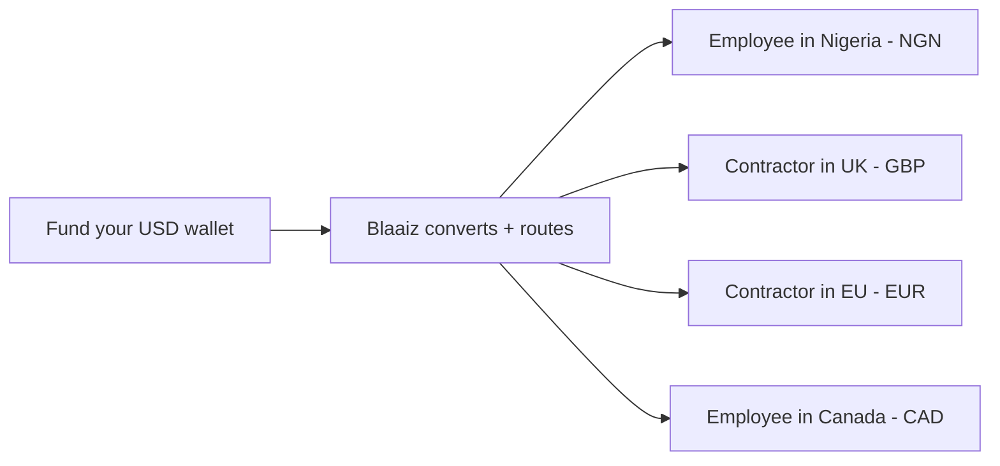
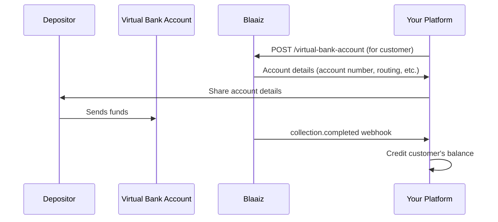
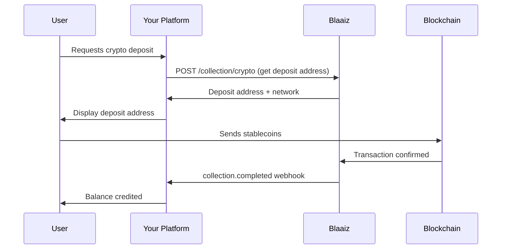
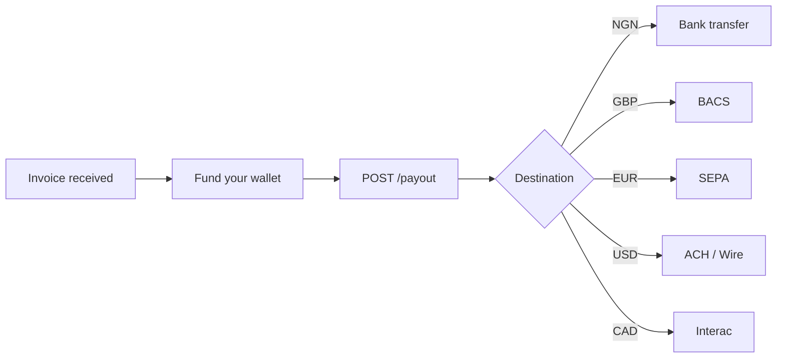

Blaaiz provides the building blocks — wallets, collections, payouts, virtual bank accounts, and currency swaps — that you combine to power a wide range of financial products. This guide walks through the most common patterns our customers build.

## Cross-border remittances

Build a remittance product that lets users send money internationally. Collect funds in one currency, convert them, and pay out in the destination currency — all through a single API integration.

**How it works**

**Step-by-step**

1. **Onboard the sender** — [Create a customer](/api-reference/customer/create) with identity documents for KYC verification.
2. **Collect funds** — Accept the sender's money via [Interac](/guides/interac-auto-deposits) (CAD), [Virtual Bank Account](/guides/virtual-bank-accounts) transfer (NGN, USD, GBP, EUR), or [card/open banking](/guides/collections-overview) collection.
3. **Preview the cost** — Call the [Fee breakdown](/api-reference/fees/get-breakdown) endpoint to calculate the exchange rate, fees, and the exact amount the recipient will receive.
4. **Payout to recipient** — [Create a payout](/api-reference/payout/create) specifying the destination currency, bank account, and amount. Use `to_amount` to guarantee the recipient receives an exact amount, or `from_amount` to send from a fixed debit.
5. **Track status** — Listen for [`payout.completed`](/guides/webhooks/payout/ngn) or `payout.failed` webhooks to update your user in real time.

**Supported corridors**

| Collect in | Pay out to | Collection method | Payout method |
|-----------|-----------|-------------------|---------------|
| CAD | NGN | Interac | Bank transfer |
| USD | NGN | Virtual Bank Account (ACH) | Bank transfer |
| GBP | NGN | Virtual Bank Account (BACS) | Bank transfer |
| EUR | NGN | Virtual Bank Account (SEPA) | Bank transfer |
| CAD | GBP | Interac | Bank transfer (BACS) |
| USD | EUR | Virtual Bank Account (ACH) | Bank transfer (SEPA) |

<Note>
Cross-currency payouts apply an exchange rate at transaction time. Always call [Fee breakdown](/api-reference/fees/get-breakdown) to preview the total cost before initiating.
</Note>

**APIs used**: [Customer](/api-reference/customer/create) · [Collection](/api-reference/collection/create) · [Payout](/api-reference/payout/create) · [Fee breakdown](/api-reference/fees/get-breakdown) · [Webhooks](/guides/webhooks/events)

---

## Marketplace and platform payouts

Operate a marketplace or platform that collects payments from buyers and disburses funds to sellers, freelancers, or service providers across multiple countries.

**How it works**

**Step-by-step**

1. **Onboard sellers** — [Create customers](/api-reference/customer/create) for each seller with KYC documents.
2. **Collect from buyers** — Use [Virtual Bank Accounts](/guides/virtual-bank-accounts) for each seller or a shared business account, depending on your reconciliation model.
3. **Funds land in your wallet** — Collections credit your business wallet after fees. See [Money movement](/guides/money-movement) for how fees are calculated.
4. **Disburse to sellers** — [Create payouts](/api-reference/payout/create) to each seller's local bank account. For sellers in different countries, Blaaiz handles the currency conversion automatically.
5. **Reconcile** — Use [List transactions](/api-reference/transaction/list) and webhooks to match collections to payouts and track your platform's margin.

<Note>
If sellers are in multiple countries (e.g. NGN and GBP), you can pay each from the same wallet — Blaaiz converts at the current exchange rate.
</Note>

**APIs used**: [Customer](/api-reference/customer/create) · [Virtual Bank Account](/api-reference/virtual-bank-account/create) · [Collection](/api-reference/collection/create) · [Payout](/api-reference/payout/create) · [Transaction](/api-reference/transaction/list)

---

## Payroll for distributed teams

Pay employees and contractors in their local currency, regardless of where your company holds funds. Fund a single wallet and run payouts to team members across NGN, GBP, EUR, CAD, and USD.

**How it works**

**Step-by-step**

1. **Fund your wallet** — Deposit funds into your business wallet via [Virtual Bank Account](/guides/virtual-bank-accounts) transfer or any supported collection method.
2. **Create employees as customers** — [Create a customer](/api-reference/customer/create) and verify identity for each team member.
3. **Preview costs** — Call [Fee breakdown](/api-reference/fees/get-breakdown) for each payout to calculate the FX rate and fees before committing.
4. **Run payouts** — [Create a payout](/api-reference/payout/create) for each employee. Use `to_amount` to guarantee each person receives the exact salary amount in their local currency.
5. **Confirm delivery** — Listen for `payout.completed` webhooks to confirm each payment landed.

<Note>
Use `to_amount` for payroll so employees receive the exact agreed salary regardless of fee or FX fluctuations. Your wallet is debited the converted amount plus fees.
</Note>

**APIs used**: [Customer](/api-reference/customer/create) · [Payout](/api-reference/payout/create) · [Fee breakdown](/api-reference/fees/get-breakdown) · [Webhooks](/guides/webhooks/events)

---

## Virtual accounts for deposit collection

Issue dedicated Virtual Bank Accounts to your customers so they can receive funds directly. When money arrives, Blaaiz credits the associated wallet and sends you a webhook — no manual reconciliation needed.

**How it works**

**Step-by-step**

1. **Verify the customer** — [Create a customer](/api-reference/customer/create) with full KYC (required for GBP, EUR, and USD accounts).
2. **Create the Virtual Bank Account** — Call [Create Virtual Bank Account](/api-reference/virtual-bank-account/create) with the customer's `wallet_id` and `customer_id`. For NGN, the account activates instantly. For GBP, EUR, and USD, listen for the [`virtual_account.ready`](/guides/webhooks/virtual-account) webhook.
3. **Share details with your customer** — Display the account number, routing number (USD), sort code (GBP), or IBAN (EUR) in your UI.
4. **Handle deposits** — When funds arrive, Blaaiz sends a `collection.completed` webhook with the amount, sender information, and Virtual Bank Account ID.
5. **Credit your customer** — Use the webhook data to update the customer's balance in your system.

**Supported currencies**

| Currency | Account type | Activation |
|----------|-------------|------------|
| NGN | Local bank account | Instant |
| USD | ACH account + routing number | Async (webhook) |
| GBP | UK sort code + account number | Async (webhook) |
| EUR | SEPA IBAN + BIC | Async (webhook) |

<Note>
Each customer can have one Virtual Bank Account per currency. Use the [Get identification type](/api-reference/virtual-bank-account/get-identification-type) endpoint to determine what TIN label to display in your UI based on the customer's country.
</Note>

**APIs used**: [Customer](/api-reference/customer/create) · [Virtual Bank Account](/api-reference/virtual-bank-account/create) · [Get Identification Type](/api-reference/virtual-bank-account/get-identification-type) · [Webhooks](/guides/webhooks/events)

---

## Crypto on/off-ramps

Let users fund their accounts with stablecoins or receive crypto payouts. Blaaiz supports collecting stablecoins and paying out to crypto wallets alongside fiat rails.

**How it works**

**Step-by-step**

1. **Get supported networks** — Call [Get crypto networks](/api-reference/collection/get-crypto-networks) to retrieve available networks and tokens.
2. **Initiate a crypto collection** — Call [Initiate crypto collection](/api-reference/collection/initiate-crypto) with the amount, token, and network. You receive a deposit address.
3. **Display to your user** — Show the deposit address and network in your UI. The user sends stablecoins from their external wallet.
4. **Confirm receipt** — Listen for the `collection.completed` webhook. Once confirmed, the equivalent value is credited to your wallet.
5. **Payout or hold** — Use the collected funds to [create a fiat payout](/api-reference/payout/create) (off-ramp) or hold the balance for future use.

**APIs used**: [Crypto networks](/api-reference/collection/get-crypto-networks) · [Crypto collection](/api-reference/collection/initiate-crypto) · [Payout](/api-reference/payout/create) · [Webhooks](/guides/webhooks/events)

---

## B2B invoice and vendor payments

Automate cross-border vendor payments. Receive invoices in any currency, fund your wallet, and pay vendors directly to their local bank accounts — no intermediary banks or manual wires needed.

**How it works**

**Step-by-step**

1. **Create vendor as customer** — [Create a customer](/api-reference/customer/create) with the vendor's business details and KYC documents.
2. **Fund your wallet** — Deposit funds via [Virtual Bank Account](/guides/virtual-bank-accounts) transfer, card, or open banking.
3. **Preview the cost** — Call [Fee breakdown](/api-reference/fees/get-breakdown) to see the total cost including FX and fees.
4. **Pay the vendor** — [Create a payout](/api-reference/payout/create) with the vendor's bank details and the invoice amount. Blaaiz routes through the optimal rail (SEPA for EUR, BACS for GBP, ACH for USD, Interac for CAD, local bank transfer for NGN).
5. **Confirm and reconcile** — Use `payout.completed` webhooks and [Get transaction](/api-reference/transaction/get) to confirm delivery and close the invoice.

**APIs used**: [Customer](/api-reference/customer/create) · [Payout](/api-reference/payout/create) · [Fee breakdown](/api-reference/fees/get-breakdown) · [Transaction](/api-reference/transaction/get) · [Webhooks](/guides/webhooks/events)

---

## What's next?

Now that you have an idea of what you can build, dive into the implementation:

<CardGroup cols={2}>
  <Card title="Getting started" icon="rocket" href="/guides/getting-started">
    Set up your API keys and make your first API call.
  </Card>
  <Card title="Money movement" icon="arrows-rotate" href="/guides/money-movement">
    Understand how funds flow through wallets, collections, and payouts.
  </Card>
  <Card title="Create your first payout" icon="money-check-dollar-pen" href="/guides/creating-first-payout">
    Walk through the full payout flow step by step.
  </Card>
  <Card title="Webhook events" icon="bell" href="/guides/webhooks/events">
    Configure webhooks to track transaction status in real time.
  </Card>
</CardGroup>
