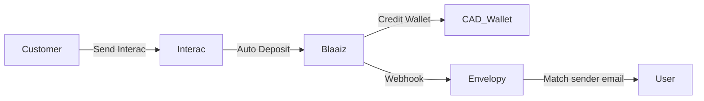

## Overview

Blaaiz supports **Interac** as a payment rail for collecting **Canadian Dollars (CAD)** from your customers.

Interac is one of the most widely used bank transfer systems in Canada, enabling fast and secure peer-to-peer and business payments directly between bank accounts.

On Blaaiz, Interac is available **exclusively for CAD transactions (collections and payouts)** and can be enhanced using **Interac Auto Deposits (collections)** to provide a seamless, no-friction payment experience for your customers.

---

## What is Interac?

**Interac e-Transfer** allows individuals and businesses in Canada to send money directly from their bank accounts using an email address.

Traditionally, recipients must:

1. Receive a transfer notification
2. Answer a security question
3. Manually accept the funds

While effective, this process introduces friction, especially for businesses handling high volumes of payments.

---

## What is Interac Auto Deposit?

**Interac Auto Deposit** eliminates manual acceptance.

When Auto Deposit is enabled:

- Funds are deposited **automatically**
- No security questions are required
- Transfers are credited instantly to the recipient’s account

### Benefits of Auto Deposit

- **Faster settlements**
- **No failed or missed transfers**
- **Better customer experience**
- **Reduced operational overhead**

Blaaiz allows businesses to configure **custom, branded Auto Deposit email addresses** that their customers can send funds to.

---

## How Blaaiz Supports Interac Auto Deposits

Blaaiz enables platform and merchant businesses to:

- Configure a **custom Interac Auto Deposit email**
- Receive CAD funds directly into their **CAD wallet**
- Track incoming payments via **webhooks**

### Example Scenario

Let’s say:

- **Company:** Envelopy
- **Domain:** `envelopy.com`
- **Business Type:** Platform business on Blaaiz

Envelopy wants to receive CAD payments from customers using Interac.

Blaaiz can configure a branded email such as:

`payments@envelopy.com`

This email becomes Envelopy’s **Interac Auto Deposit address**.

Any funds sent to this email will:

- Be auto-deposited
- Land directly in Envelopy’s **CAD wallet on Blaaiz**

---

## Set up through the API

Your business must have API services enabled and an existing CAD wallet.

1. Grant `interac-auto-deposit-email:create` and `interac-auto-deposit-email:read` to your OAuth credentials.
2. Request an access token with those individual scopes.
3. [Configure your webhook URL](/guides/webhooks/events) to receive registration status updates.
4. Submit the email for registration.

```bash
curl --request POST 'https://api-prod.blaaiz.com/api/external/interac-auto-deposit-email' \
  --header 'Authorization: Bearer YOUR_ACCESS_TOKEN' \
  --header 'Content-Type: application/json' \
  --header 'Accept: application/json' \
  --data '{"email":"payments@example.com"}'
```

The API returns HTTP `201`:

```json
{
  "data": {
    "id": "01994c21-a4d0-7000-8000-123456789abc",
    "email": "payments@example.com",
    "status": "PENDING",
    "created_at": "2026-09-16T10:00:00.000000Z",
    "updated_at": "2026-09-16T10:00:00.000000Z"
  }
}
```

The request enters the same review process as a dashboard submission. Blaaiz admins complete the external setup before they change the status.

<Note>
A `201` response confirms receipt of the registration request. Wait for `ACTIVE` before you ask customers to send funds.
</Note>

The email must pass the same uniqueness checks as a dashboard submission. A repeated request for the same live email returns `422`.
After an uncertain response, list your registrations before you retry the create request.

| Action | Endpoint | OAuth scope |
| --- | --- | --- |
| [Register an email](/api-reference/interac-auto-deposit-email/register-an-interac-auto-deposit-email) | `POST /api/external/interac-auto-deposit-email` | `interac-auto-deposit-email:create` |
| [List emails](/api-reference/interac-auto-deposit-email/list-interac-auto-deposit-emails) | `GET /api/external/interac-auto-deposit-email` | `interac-auto-deposit-email:read` |
| [View one email](/api-reference/interac-auto-deposit-email/get-an-interac-auto-deposit-email) | `GET /api/external/interac-auto-deposit-email/{id}` | `interac-auto-deposit-email:read` |

The list returns 10 records per page. Use `status`, `search_term`, and `page` to filter or navigate the results.
The response contains a `data` array, `links`, and pagination fields under `meta`.
Both read endpoints include your dashboard and API registrations. They exclude deleted registrations and registrations from other businesses.

The single-record endpoint uses the registration ID, not the email address. An unknown, deleted, or other business's ID returns `404`.
You cannot change the registration status through these API endpoints.

See [Authentication](/guides/authentication#scopes) for credential setup and scope bundles.

## Set up through the dashboard

### Step 1: Access the CAD Wallet

A **Super Admin** logs into the **Blaaiz Business Dashboard** and navigates to their **CAD wallet**.

On the wallet screen, they will see an option labeled:

> **Interac Auto Deposit**


---

### Step 2: Add an Auto Deposit Email

Click **Interac Auto Deposit** to open the configuration interface.

Here, you can:

- Add the email address you want configured for Auto Deposit
- Use a branded domain (recommended)
- Following our example, Envelopy would add `payments@envelopy.com`

---

### Step 3: Configuration Statuses

Auto Deposit setup is **not instant**. Each registration has one of these statuses:

| Status       | Meaning                                   |
| ------------ | ----------------------------------------- |
| `PENDING`    | Request submitted and awaiting review     |
| `PROCESSING` | Blaaiz is configuring the Auto Deposit    |
| `ACTIVE`     | Setup complete and ready to receive funds |
| `BLOCKED`    | Registration is blocked; contact Blaaiz support |

When an admin changes the status to `ACTIVE` or `BLOCKED`, Blaaiz sends a [registration status webhook](/guides/webhooks/interac-auto-deposit-email).
Your business needs API services enabled, a webhook URL, and a webhook signing secret.
Use the read endpoints to check the current status if you miss a webhook.

---

## Receiving Funds from Customers

Once active, all you need to do is:

1. Display the configured Interac email address in your product
2. Ask customers to send payments to that email
3. Funds will be auto-deposited into your **CAD wallet**

When a customer sends money:

- Blaaiz receives the funds
- Your CAD wallet is credited
- A **collection webhook** is emitted

---

## Identifying Who Sent the Payment

A common question we get is:

> **“How do I know which customer made the deposit?”**

We’ve got you covered.

### Webhook Source Information

Every CAD collection webhook includes a `source_information` object.

This object contains:

- The **sender’s Interac email address**

You can use this to identify the customer who initiated the payment.

👉 See the full webhook payload here:  
**[CAD Collection Webhook Sample](/guides/webhooks/collection/cad)**

---

## Recommended Infrastructure Design

To reliably map incoming Interac payments to your users, we recommend the following setup.

### User → Interac Email Mapping

If Envelopy has a `users` table, we strongly advise adding a related table:

`user_interac_emails`

#### Suggested Structure

```text
users
└── id

user_interac_emails
├── id
├── user_id (FK → users.id)
├── email (unique)
```

#### Flowchart

Here is a high-level overview of the process:


```mermaid
flowchart LR
  Customer -->|Send Interac| Interac
  Interac -->|Auto Deposit| Blaaiz
  Blaaiz -->|Credit Wallet| CAD_Wallet
  Blaaiz -->|Webhook| Envelopy
  Envelopy -->|Match sender email| User
```
