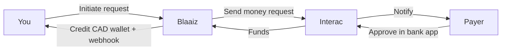

## Overview

Alongside [Interac Auto Deposits](/guides/interac-auto-deposits), Blaaiz supports **Interac money requests** for collecting **Canadian Dollars (CAD)**.

Where Auto Deposit is a **push** flow — your customer sends an e-Transfer to your email and Blaaiz credits you — a money request is the **pull** counterpart. Your platform asks Blaaiz to send an Interac money request to a payer, the payer approves it from their banking app, and the funds land in your CAD wallet.

Interac money requests are available **exclusively for CAD collections**.

---

## What is an Interac money request?

An **Interac money request** is a request for payment sent to someone's email address. Instead of waiting for the payer to remember to send funds, you initiate the collection:

1. You tell Blaaiz the **amount** and the **payer's email**.
2. Blaaiz sends an Interac money request to that email.
3. The payer opens their banking app and **approves** the request.
4. The funds are sent and Blaaiz credits your CAD wallet.

This is ideal when you know exactly how much to collect and from whom — invoicing, on-demand top-ups, or any flow where you'd rather initiate the collection than display an email and hope the customer sends the right amount.

---

## Push vs pull: Auto Deposit vs money request

|                  | Money request (pull)                              | Auto Deposit (push)                          |
| ---------------- | ------------------------------------------------- | -------------------------------------------- |
| Who starts it    | Your platform                                     | Your customer                                |
| Email you use    | The **payer's** email                             | Your own branded Auto Deposit email          |
| Customer action  | Approve a request in their bank app               | Send an e-Transfer to your email             |
| Best for         | Invoicing / on-demand requests with a known amount | Open-ended inbound payments                  |
| Setup required   | Interac enabled + active CAD wallet               | An active Auto Deposit email                 |

Both rails credit the same CAD wallet and emit the same [CAD collection webhook](/guides/webhooks/collection/cad).

---

## How Blaaiz supports Interac money requests

Blaaiz enables platform and merchant businesses to:

- **Initiate** a money request to any payer email
- **Receive** CAD funds directly into their CAD wallet once the payer approves
- **Track** the outcome via collection webhooks

### Example scenario

Let's say:

- **Company:** Envelopy
- **Business Type:** Platform business on Blaaiz

Envelopy invoices a customer, `payer@example.com`, for **100 CAD**. Instead of emailing an Auto Deposit address and waiting, Envelopy initiates a money request for that exact amount. The payer receives an Interac notification, approves it in their bank app, and the **net amount** lands in Envelopy's CAD wallet — confirmed by a collection webhook.

---

## Lifecycle

A money request settles **asynchronously**. Initiating it does not move money — it only sends the request.

The collection stays **`PENDING`** from the moment you initiate it until the payer approves. You learn the final outcome from the collection webhook — never treat the initiation response as settlement.

| State        | Meaning                                                        |
| ------------ | -------------------------------------------------------------- |
| `PENDING`    | Request sent to the payer; awaiting their approval             |
| `SUCCESSFUL` | Payer approved; your CAD wallet has been credited (net of fee) |
| Expired      | Payer didn't approve before `expires_at`; no funds move        |

### Expiry

A money request expires if the payer doesn't approve it in time. By default the request is valid for **48 hours**; you can shorten or extend this when initiating it, up to a maximum of **120 hours**. Once expired, no funds move and no success webhook is sent.

---

## Fees

The standard **INTERAC collection fee** applies — the same as Auto Deposit collections. Your wallet is credited the **net** amount; the webhook reports both the fee (`transaction_fee`) and the net (`transaction_amount_without_fee`).

---

## Identifying who paid

Like Auto Deposit, every CAD collection webhook includes a `source_information` object containing the payer's Interac email. Match the webhook to the collection you initiated using the `transaction_reference` (the reference returned when you initiated the request) or the `transaction_id`.

👉 See the full webhook payload here:
**[CAD Collection Webhook Sample](/guides/webhooks/collection/cad)**

---

## Integrating via the API

This page covers the concept. For the end-to-end API integration — request fields, sample requests and responses, and handling the webhook — see:

- **[Interac money requests use case](/guides/use-cases/interac-money-requests)**
- **[Initiate Interac money request](/api-reference/collection/initiate-interac)** (API reference)
- **[Authentication & scopes](/guides/authentication)** — requires the `collection:interac:create` scope
