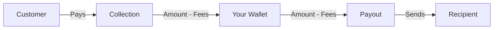
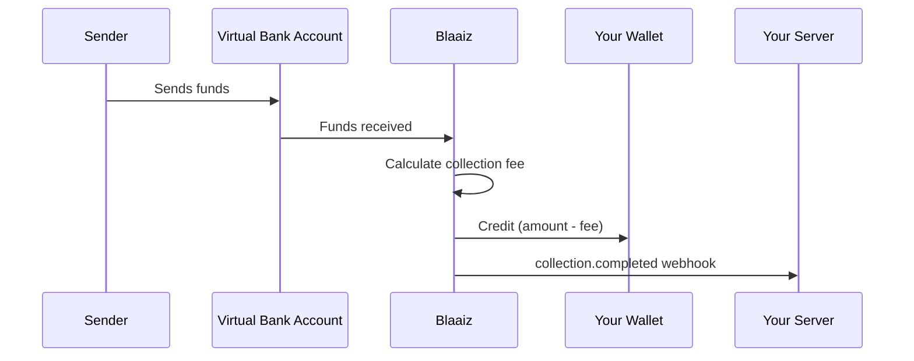
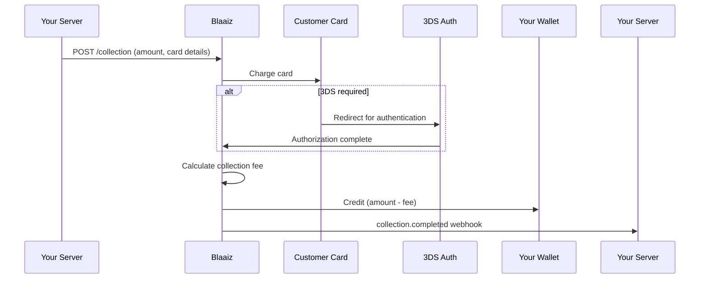
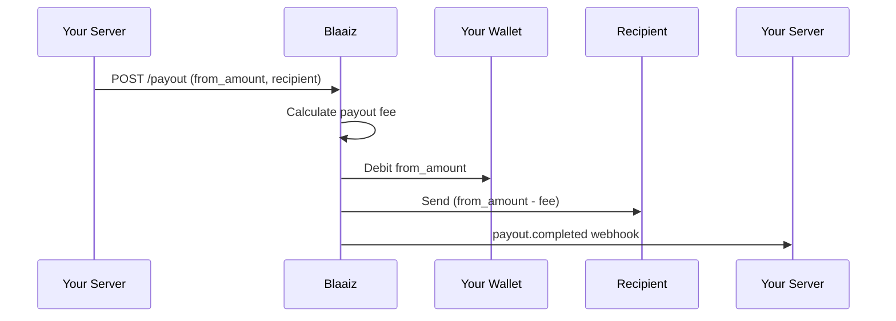
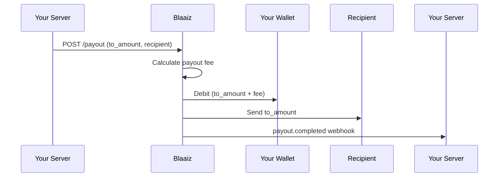

This guide explains exactly what happens to money at each step when you use Blaaiz API services for collections and payouts.

## Core concept: Wallets are the center

Every money movement in Blaaiz goes through your **business wallets**. Each wallet holds a balance in a single currency (NGN, USD, GBP, EUR, CAD). Collections add funds to a wallet, and payouts deduct funds from a wallet.

## Collections (inbound)

A collection is any inflow of funds into your business wallet. This can happen via a Virtual Bank Account transfer or card payment.

### Virtual Bank Account collection

When someone sends money to your Virtual Bank Account:

1. Funds arrive at the Virtual Bank Account.
2. Blaaiz calculates the applicable **collection fee**.
3. The fee is **deducted from the incoming amount** before crediting your wallet.
4. Your wallet is credited with the **amount minus fees**.
5. A `collection.completed` webhook is sent to your `collection_url`.

**Example**: A customer sends 10,000 NGN to your Virtual Bank Account.

| Step | Amount |
|------|--------|
| Incoming amount | 10,000 NGN |
| Collection fee | 100 NGN |
| **Credited to your wallet** | **9,900 NGN** |

The webhook payload includes both the total amount and the fee, so you can reconcile.

### Card collection (API)

When you initiate a card collection via the API:

1. You specify the `amount` to collect from the customer.
2. The customer's card is charged for the full amount.
3. Blaaiz calculates the **collection fee**.
4. The fee is **deducted from the collected amount** before crediting your wallet.
5. Your wallet is credited with the **amount minus fees**.
6. A `collection.completed` webhook is sent to your `collection_url`.

**Example**: You collect 50,000 NGN via card.

| Step | Amount |
|------|--------|
| Charged to card | 50,000 NGN |
| Collection fee | 750 NGN |
| **Credited to your wallet** | **49,250 NGN** |

<Note>
If the card requires 3DS authorization, the customer is redirected to complete authentication. If you provided a `redirect_url`, the customer returns to your site after authorization. See [Initiate collection](/api-reference/collection/create).
</Note>

## Payouts (outbound)

A payout sends funds from your wallet to an external recipient (bank account, mobile money, etc.).

When creating a payout, you choose one of two amount modes by passing **either** `from_amount` or `to_amount` (never both):

| Parameter | Meaning |
|-----------|---------|
| `from_amount` | The total amount debited from your wallet. Fees are deducted from this, so the recipient gets less. |
| `to_amount` | The exact amount the recipient receives. Fees are added on top, so your wallet is debited more. |

### Using `from_amount`

When you pass `from_amount`, fees are **inclusive** — deducted from the amount you specify:

1. You specify `from_amount` — this is the total debited from your wallet.
2. Blaaiz calculates the applicable **payout fee** (fixed, percentage, or both).
3. `from_amount` is deducted from your wallet.
4. The **recipient receives** `from_amount` minus fees.
5. A `payout.completed` webhook is sent to your `payout_url`.

**Example**: `from_amount: 1000`, payout fee is 5 USD.

| Step | Amount |
|------|--------|
| `from_amount` | 1,000 USD |
| Payout fee | 5 USD |
| **Deducted from your wallet** | **1,000 USD** |
| **Recipient receives** | **995 USD** |

### Using `to_amount`

When you pass `to_amount`, the recipient is **guaranteed** to receive the exact amount you specify. Fees are added on top:

1. You specify `to_amount` — this is exactly what the recipient will receive.
2. Blaaiz calculates the fees and adds them to determine the wallet debit.
3. Your wallet is debited `to_amount` + fees.
4. The **recipient receives** exactly `to_amount`.
5. A `payout.completed` webhook is sent to your `payout_url`.

**Example**: `to_amount: 1000`, payout fee is 5 USD.

| Step | Amount |
|------|--------|
| `to_amount` | 1,000 USD |
| Payout fee | 5 USD |
| **Deducted from your wallet** | **1,005 USD** |
| **Recipient receives** | **1,000 USD** |

<Note>
If your wallet balance is insufficient to cover the total debit (amount + fees in `to_amount` mode, or the full `from_amount`), the payout will fail.
</Note>

## Cross-currency payouts

When your wallet currency differs from the recipient's currency, an exchange rate is applied:

1. The exchange rate is determined at transaction time.
2. Fees are calculated in the **source currency** (your wallet currency).
3. The converted amount (minus fees) is sent to the recipient in the destination currency.

Use the [Fee breakdown](/api-reference/fees/get-breakdown) endpoint to preview the exact fees and exchange rate before initiating a payout.

## Summary

| Flow | Parameter | Fee handling | What your wallet sees |
|------|-----------|-------------|----------------------|
| **Collection** (VIBAN, card) | `amount` | Fees deducted from incoming amount | Credited: amount minus fees |
| **Payout** (`from_amount`) | `from_amount` | Fees deducted from `from_amount` | Debited: `from_amount` |
| **Payout** (`to_amount`) | `to_amount` | Fees added on top of `to_amount` | Debited: `to_amount` + fees |

## Related

- [Fee breakdown](/api-reference/fees/get-breakdown) — preview fees before a transaction.
- [Initiate collection](/api-reference/collection/create) — collect funds via card.
- [Create payout](/api-reference/payout/create) — send funds to a recipient.
- [Webhook events](/guides/webhooks/events) — track transaction status changes.
