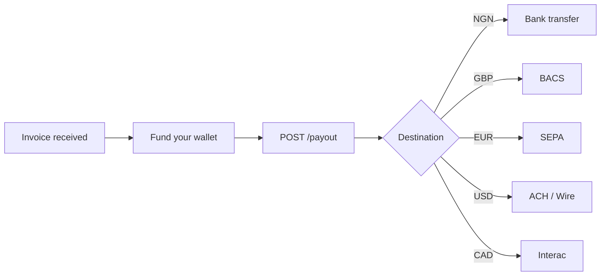

Automate cross-border vendor payments. Receive invoices in any currency, fund your wallet, and pay vendors directly to their local bank accounts — no intermediary banks or manual wires needed.

## How it works

## Step-by-step

1. **Create vendor as customer** — [Create a customer](/api-reference/customer/create) with `type=business` and the vendor's business details, then verify them through the [KYB flow](/guides/kyb/overview) (beneficial owners + KYB documents + `/submit`). If the vendor is a sole trader / freelancer, use `type=individual` and the standard KYC flow instead. Do not use the legacy `/files` endpoint for `type=business` — it doesn't trigger verification for business customers.
2. **Fund your wallet** — Deposit funds via [Virtual Bank Account](/guides/virtual-bank-accounts) transfer or [Interac](/guides/interac-auto-deposits) (CAD). Your wallet is credited automatically when funds arrive.
3. **Preview the cost** — Call [Fee breakdown](/api-reference/fees/get-breakdown) to see the total cost including FX and fees.
4. **Pay the vendor** — [Create a payout](/api-reference/payout/create) with the vendor's bank details and the invoice amount. Blaaiz routes through the optimal rail (SEPA for EUR, BACS for GBP, ACH for USD, Interac for CAD, local bank transfer for NGN).
5. **Confirm and reconcile** — Use `payout.completed` webhooks and [Get transaction](/api-reference/transaction/get) to confirm delivery and close the invoice.

## APIs used

- [Create customer](/api-reference/customer/create)
- [Create payout](/api-reference/payout/create)
- [Fee breakdown](/api-reference/fees/get-breakdown)
- [Get transaction](/api-reference/transaction/get)
- [Webhook events](/guides/webhooks/events)
