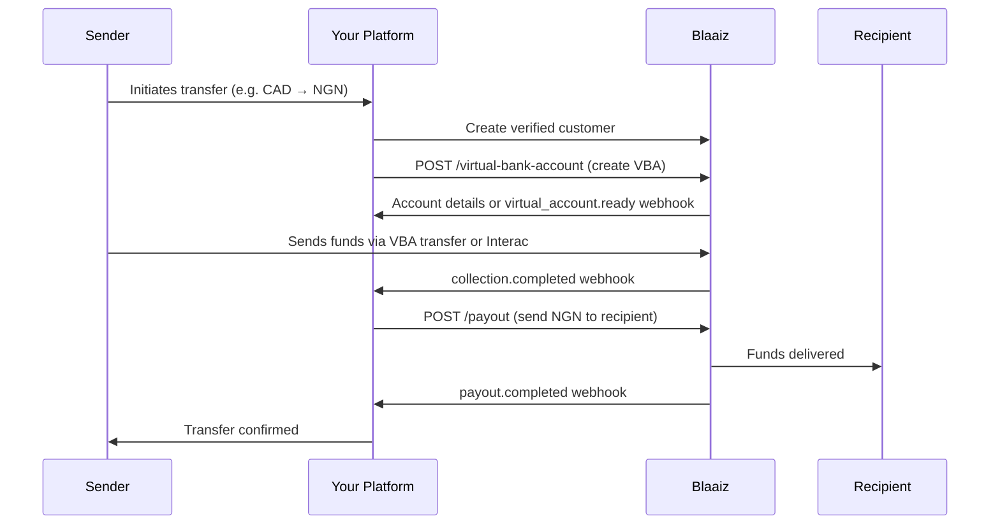

Build a remittance product that lets users send money internationally. Collect funds in one currency, convert them, and pay out in the destination currency — all through a single API integration.

## How it works

## Step-by-step

1. **Onboard the sender** — [Create a customer](/api-reference/customer/create) and verify them. For `type=individual`, use the standard KYC flow — only a **Driver's License**, **Passport**, or **Resident Permit** is accepted, **ID cards (National Identity Cards) are not**. For `type=business`, follow the [KYB flow](/guides/kyb/overview) — beneficial owners and KYB documents instead of the legacy `/files` flow. All document images must be clear and legible — unclear images will be rejected, and repeated submission of fraudulent documents will result in the customer being permanently blacklisted.\n\n   <Note>\n   For cross-border senders, USD/GBP/EUR Virtual Bank Accounts in step 2 currently support `type=individual` only. NGN VBAs work for both types.\n   </Note>
2. **Create a Virtual Bank Account** — Call [POST /virtual-bank-account](/api-reference/virtual-bank-account/create) with your business `wallet_id` and the `customer_id`. For NGN, the account activates instantly. For USD, GBP, and EUR, wait for the [`virtual_account.ready`](/guides/webhooks/virtual-account) webhook before sharing the account details. See the [Virtual Bank Accounts guide](/guides/virtual-bank-accounts) for currency-specific prerequisites.
3. **Collect funds** — The sender deposits money into the Virtual Bank Account. The collection method depends on the source currency:
   - **CAD**: Sender pays via [Interac](/guides/interac-auto-deposits) — no API call needed, you receive a `collection.completed` webhook when funds arrive.
   - **NGN, USD, GBP, EUR**: Sender transfers to your [Virtual Bank Account](/guides/virtual-bank-accounts) — you receive a `collection.completed` webhook when funds settle.
   - **Card**: You initiate a card charge via [POST /collection](/api-reference/collection/create) (card collections only, must be enabled for your business).
4. **Preview the cost** — Call the [Fee breakdown](/api-reference/fees/get-breakdown) endpoint to calculate the exchange rate, fees, and the exact amount the recipient will receive.
5. **Payout to recipient** — [Create a payout](/api-reference/payout/create) specifying the destination currency, bank account, and amount. Use `to_amount` to guarantee the recipient receives an exact amount, or `from_amount` to send from a fixed debit.
6. **Track status** — Listen for [`payout.completed`](/guides/webhooks/payout/ngn) or `payout.failed` webhooks to update your user in real time.

## Supported corridors

| Collect in | Pay out to | Collection method | Payout method |
|-----------|-----------|-------------------|---------------|
| CAD | NGN | Interac | Bank transfer |
| USD | NGN | Virtual Bank Account (ACH) | Bank transfer |
| GBP | NGN | Virtual Bank Account (BACS) | Bank transfer |
| EUR | NGN | Virtual Bank Account (SEPA) | Bank transfer |
| CAD | GBP | Interac | Bank transfer (BACS) |
| USD | EUR | Virtual Bank Account (ACH) | Bank transfer (SEPA) |

<Note>
Cross-currency payouts apply an exchange rate at transaction time. Always call [Fee breakdown](/api-reference/fees/get-breakdown) to preview the total cost before initiating.
</Note>

## APIs used

- [Create customer](/api-reference/customer/create)
- [Create Virtual Bank Account](/api-reference/virtual-bank-account/create)
- [Create payout](/api-reference/payout/create)
- [Fee breakdown](/api-reference/fees/get-breakdown)
- [Webhook events](/guides/webhooks/events)
