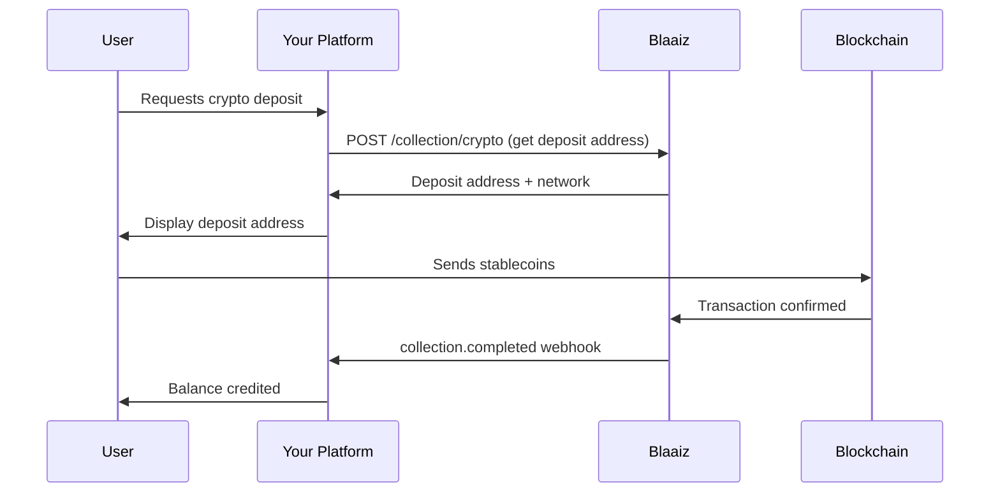
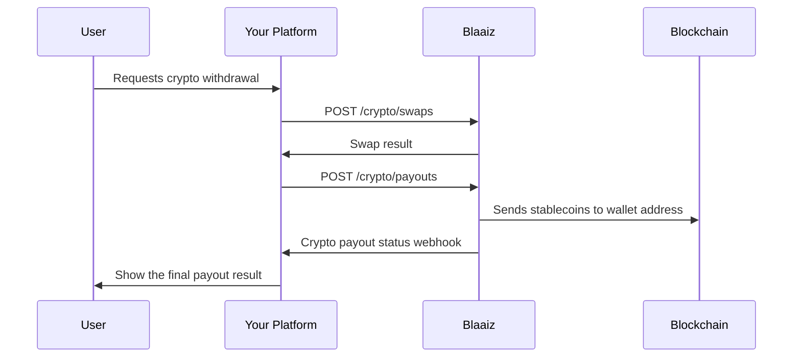

<Warning>
**The Payout API no longer supports crypto payouts.** Use the [Crypto API](/guides/crypto-api) for wallet swaps and on-chain crypto payouts. Crypto collections remain available for eligible, crypto-enabled businesses.
</Warning>

Use crypto collections to receive supported stablecoins. Use the Crypto API to move a business balance or send an on-chain crypto payout.

## On-ramp: Crypto to fiat

Use this flow to receive a supported stablecoin and settle its value in a fiat wallet.

### How it works

### Step-by-step

1. Call [Get crypto networks](/api-reference/collection/get-crypto-networks).
2. Call [Initiate a crypto collection](/api-reference/collection/initiate-crypto-collection).
3. Show the deposit address and network to the user.
4. Wait for the `collection.completed` webhook.
5. Use [Create a fiat payout](/api-reference/payout/create-a-payout) to send the fiat balance to a bank account.

## Off-ramp: Fiat to crypto

Use two Crypto API requests to send value from a fiat wallet to an external crypto address.

### How it works

### Step-by-step

1. Get the destination address, token, and network.
2. Get the business crypto wallet ID for the token.
3. Call [Create a crypto swap](/api-reference/crypto/create-a-crypto-swap).
4. Call [Create a crypto payout](/api-reference/crypto/create-a-crypto-payout).
5. Check the transaction status until it is `SUCCESSFUL` or `FAILED`.

<Note>
Use [List crypto assets](/api-reference/crypto/list-crypto-assets) to see the active tokens and networks for your business.
</Note>

## APIs used

- [Get crypto networks](/api-reference/collection/get-crypto-networks)
- [Initiate crypto collection](/api-reference/collection/initiate-crypto-collection)
- [Crypto API](/guides/crypto-api)
- [Create a crypto swap](/api-reference/crypto/create-a-crypto-swap)
- [Create a crypto payout](/api-reference/crypto/create-a-crypto-payout)
- [Webhook events](/guides/webhooks/events)
