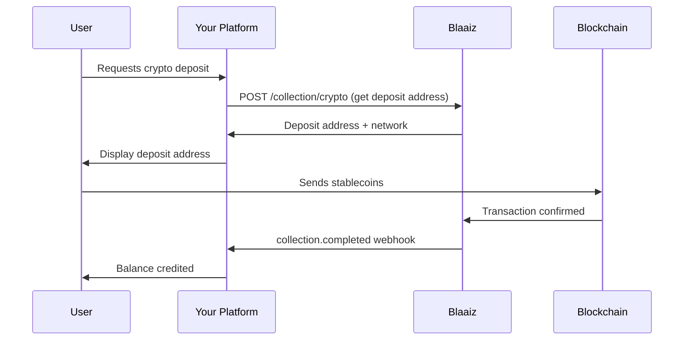
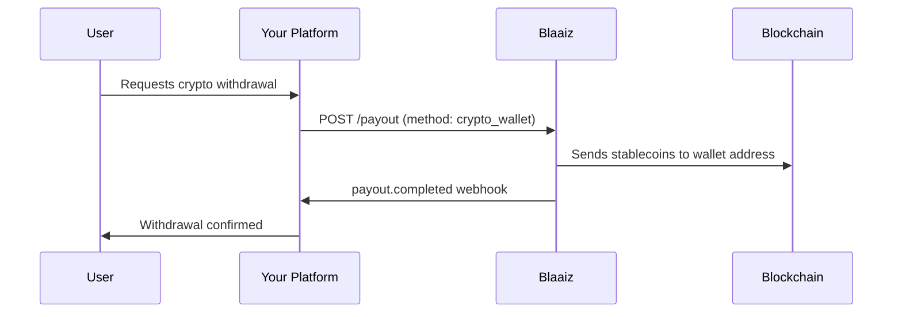

Let users move between crypto and fiat currencies. Blaaiz supports collecting stablecoins (on-ramp) and paying out to crypto wallets (off-ramp) alongside traditional fiat rails.

## On-ramp: Crypto to fiat

Accept stablecoin deposits from users and settle the value into your fiat wallet, or hold the balance for future fiat payouts.

### How it works

### Step-by-step

1. **Get supported networks** — Call [Get crypto networks](/api-reference/collection/get-crypto-networks) to retrieve available networks and tokens.
2. **Initiate a crypto collection** — Call [Initiate crypto collection](/api-reference/collection/initiate-crypto) with the amount, token, and network. You receive a deposit address.
3. **Display to your user** — Show the deposit address and network in your UI. The user sends stablecoins from their external wallet.
4. **Confirm receipt** — Listen for the `collection.completed` webhook. Once confirmed, the equivalent value is credited to your wallet.
5. **Convert to fiat** — The collected value lands in your business wallet. From there you can [create a fiat payout](/api-reference/payout/create) to the user's bank account, or [swap](/api-reference/swap/create) to another currency.

## Off-ramp: Fiat to crypto

Send funds from your fiat wallet to a user's crypto wallet address. This lets users withdraw their balance as stablecoins.

### How it works

### Step-by-step

1. **Collect the user's wallet details** — Get the user's wallet address, token, and network.
2. **Preview fees** — Call [Fee breakdown](/api-reference/fees/get-breakdown) to show the user the network fees and any conversion costs.
3. **Create a crypto payout** — [Create a payout](/api-reference/payout/create) with `method: "crypto_wallet"` and include the `wallet_address`, `wallet_token`, and `wallet_network` fields.
4. **Track delivery** — Listen for the `payout.completed` webhook to confirm the on-chain transaction was sent.

<Note>
Crypto payout support varies by token and network. Contact [support@blaaiz.com](mailto:support@blaaiz.com) to confirm which crypto payout rails are available for your business.
</Note>

## APIs used

- [Get crypto networks](/api-reference/collection/get-crypto-networks)
- [Initiate crypto collection](/api-reference/collection/initiate-crypto)
- [Create payout](/api-reference/payout/create)
- [Fee breakdown](/api-reference/fees/get-breakdown)
- [Webhook events](/guides/webhooks/events)
