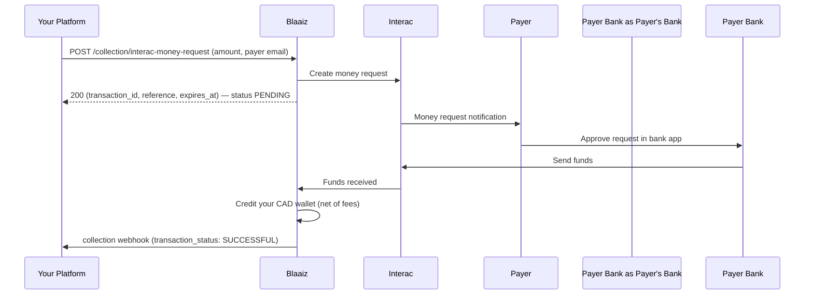

Collect Canadian Dollars by **requesting** them. Instead of waiting for a customer to push an Interac e-Transfer to your Auto Deposit email, your platform calls one endpoint and Blaaiz sends an Interac money request to the payer's email. The payer approves it from their banking app, the funds land in your CAD wallet, and you receive a collection webhook.

This is the **pull** counterpart to [Interac Auto Deposit collections](/guides/use-cases/interac-collections) (the push flow). Use it when you'd rather initiate the collection than display an email and hope the customer sends the right amount.

## How it works



The initial API call returns immediately with the collection in a **`PENDING`** state. Settlement happens asynchronously once the payer approves — you learn the final outcome from the collection webhook, not the initial response.

## Prerequisites

- A business with **API Services enabled** and an **active CAD wallet**.
- Interac enabled for CAD on your account.
- An OAuth credential that includes the **`collection:interac:create`** scope (part of the `collections` and `full-access` bundles). See [Authentication](/guides/authentication).

## Initiate a money request

Send the amount and the payer's email. Blaaiz sends the Interac request to that email.

```bash
curl -X POST https://api-prod.blaaiz.com/api/external/collection/interac-money-request \
  -H "Authorization: Bearer YOUR_ACCESS_TOKEN" \
  -H "Content-Type: application/json" \
  -d '{
    "amount": 100,
    "email": "payer@example.com"
  }'
```

Response:

```json
{
  "message": "Interac money request sent successfully.",
  "transaction_id": "20580e50-1b32-40a6-aa46-ac8e795b3zas",
  "reference": "CA1MR6ahQBCJ",
  "expires_at": "2026-06-14T10:00:00+00:00"
}
```

| Field | Description |
|-------|-------------|
| `transaction_id` | Blaaiz transaction ID for the pending collection. Store it to reconcile against the webhook. |
| `reference` | The Interac reference number for the money request. |
| `expires_at` | When the request expires if the payer doesn't approve it (48 hours from creation). |

### Request fields

| Field | Required | Description |
|-------|----------|-------------|
| `amount` | Yes | CAD amount to request, in major units (e.g. `100.00`). |
| `email` | Yes | The payer's email — Blaaiz sends the Interac request here. |
| `customer_name` | No | Display name for the payer on the request. Defaults to your business name. |
| `customer_id` | No | A `VERIFIED` customer belonging to your business, to attribute the collection to. |
| `expiry_hours` | No | Hours until the request expires if the payer doesn't approve it. Defaults to `48`; max `120`. |

<Note>
Unlike [Auto Deposit collections](/guides/use-cases/interac-collections), the `email` here is the **payer's** address (where the request is sent), not your business Auto Deposit email. You don't need an Auto Deposit email configured for this flow.
</Note>

## Handle the collection webhook

When the payer approves the request, Blaaiz credits your CAD wallet and sends a `collection` webhook to your configured `collection_url`. Match it to the pending collection using `transaction_reference` (the `reference` from the initiate response) or `transaction_id`.

```json
{
  "message": "Transaction Completed",
  "transaction_id": "20580e50-1b32-40a6-aa46-ac8e795b3zas",
  "transaction_reference": "CA1MR6ahQBCJ",
  "transaction_status": "SUCCESSFUL",
  "transaction_fee": 2.0,
  "transaction_amount_without_fee": 98.0,
  "transaction_amount": 100.0,
  "transaction_currency": "CAD",
  "source_information": {
    "collection_email": "payer@example.com",
    "collection_name": "John Doe"
  },
  "event_id": "9d46a6c7-fbb4-48f0-912c-4f9611fe5844",
  "type": "collection"
}
```

Only credit the customer in your system once `transaction_status` is `SUCCESSFUL`. See the [CAD collection webhook payload](/guides/webhooks/collection/cad) for the full schema.

## Fees

The standard **INTERAC collection fee** applies, the same as Auto Deposit collections. Your wallet is credited the **net** amount (`transaction_amount_without_fee`); `transaction_fee` shows the fee deducted.

## Money request vs Auto Deposit

| | Initiate money request (pull) | Auto Deposit (push) |
|---|---|---|
| Who starts it | Your platform, via API | Your customer, from their bank |
| Email you pass | The **payer's** email | n/a (you display your Auto Deposit email) |
| Customer action | Approve a request in their bank app | Send an e-Transfer to your email |
| Setup required | `collection:interac:create` scope | An active Auto Deposit email |
| Best for | Invoicing / on-demand requests with a known amount | Open-ended inbound payments |

## Common pitfalls

**Treating the 200 response as settlement.** The initiate call only confirms the request was sent. The collection is `PENDING` until the payer approves it — always wait for the `SUCCESSFUL` collection webhook before releasing value.

**Payer doesn't approve in time.** Money requests expire at `expires_at` — 48 hours after creation by default, or sooner if you set `expiry_hours` (max 120). If the payer never approves, no funds move and no success webhook is sent.

**No active CAD wallet.** The endpoint returns `400` with `No active CAD wallet found...` if your business has no CAD wallet. Create one first.

## APIs used

- [Initiate Interac money request](/api-reference/collection/initiate-interac)
- [CAD collection webhook payload](/guides/webhooks/collection/cad)
- [Authentication & scopes](/guides/authentication)
- [Accept incoming Interac money request](/api-reference/collection/accept-interac) — for externally received transfers
