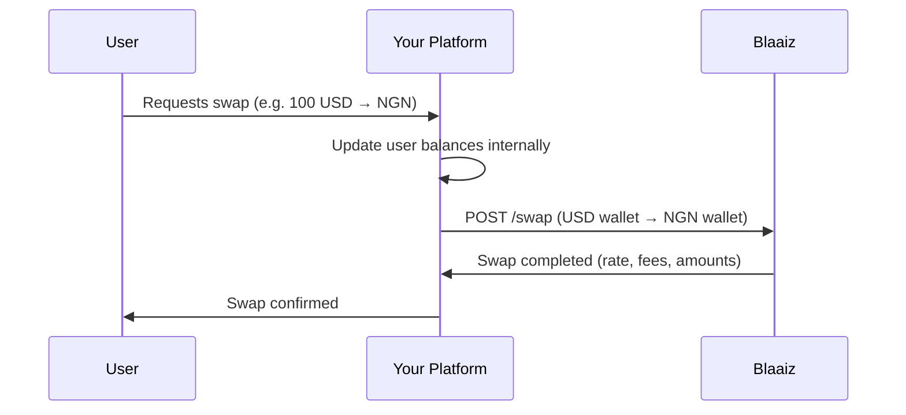

If your platform manages user balances internally and supports multi-currency wallets, you can mirror your users' currency swaps on Blaaiz to keep your liquidity balanced across currencies.

## How it works

## Step-by-step

1. **User requests a swap** — Your user wants to convert funds between currencies in your app (e.g. USD to NGN).
2. **Preview the rate** — Call [Fee breakdown](/api-reference/fees/get-breakdown) to show the user the exchange rate and fees before confirming.
3. **Execute the swap** — Call [POST /swap](/api-reference/swap/create) with your `from_business_wallet_id`, `to_business_wallet_id`, and `amount`. Use `amount_type: "from"` to specify how much to debit, or `amount_type: "to"` to specify how much the destination wallet should receive.
4. **Update your user's balance** — The swap response includes the exact `from_amount`, `to_amount`, and `from_exchange_rate` applied. Use these to update the user's balances in your system.

<Note>
Swaps are between your own business wallets — both wallets must belong to the same business and hold different currencies. The swap executes instantly and the response includes the final amounts and rate applied.
</Note>

## Why mirror swaps on Blaaiz?

Even if you manage user balances in your own database, executing a corresponding swap on Blaaiz ensures your business wallet balances stay aligned with your users' aggregate holdings. Without this, you may end up with excess liquidity in one currency and a deficit in another — which would block payouts.

## APIs used

- [Swap](/api-reference/swap/create)
- [Fee breakdown](/api-reference/fees/get-breakdown)
- [List wallets](/api-reference/wallet/list)
