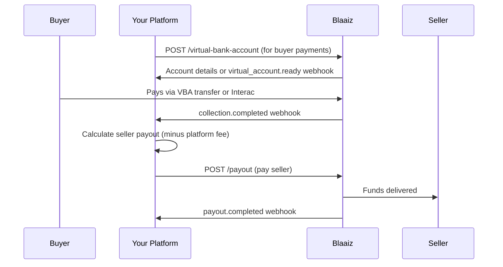

Operate a marketplace or platform that collects payments from buyers and disburses funds to sellers, freelancers, or service providers across multiple countries.

## How it works

## Step-by-step

1. **Onboard sellers** — [Create customers](/api-reference/customer/create) for each seller with KYC documents.
2. **Create Virtual Bank Accounts** — Call [POST /virtual-bank-account](/api-reference/virtual-bank-account/create) to provision accounts for receiving buyer payments. For NGN accounts, activation is instant. For USD, GBP, and EUR, wait for the [`virtual_account.ready`](/guides/webhooks/virtual-account) webhook before sharing account details.
3. **Collect from buyers** — Share the Virtual Bank Account details with buyers. When a buyer sends money, the funds land in your wallet and you receive a `collection.completed` webhook — no API call required. For CAD, buyers pay via [Interac](/guides/interac-auto-deposits).
4. **Funds land in your wallet** — Collections credit your business wallet after fees. See [Money movement](/guides/money-movement) for how fees are calculated.
5. **Disburse to sellers** — [Create payouts](/api-reference/payout/create) to each seller's local bank account. For sellers in different countries, Blaaiz handles the currency conversion automatically.
6. **Reconcile** — Use [List transactions](/api-reference/transaction/list) and webhooks to match collections to payouts and track your platform's margin.

<Note>
If sellers are in multiple countries (e.g. NGN and GBP), you can pay each from the same wallet — Blaaiz converts at the current exchange rate.
</Note>

## APIs used

- [Create customer](/api-reference/customer/create)
- [Create Virtual Bank Account](/api-reference/virtual-bank-account/create)
- [Create payout](/api-reference/payout/create)
- [List transactions](/api-reference/transaction/list)
- [Webhook events](/guides/webhooks/events)
