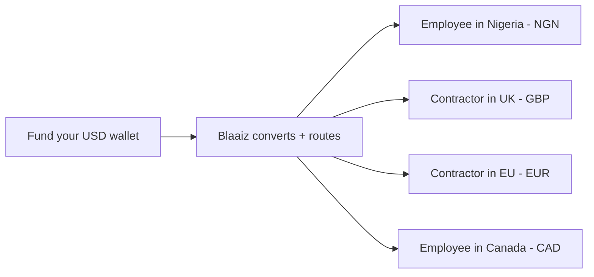

Pay employees and contractors in their local currency, regardless of where your company holds funds. Fund a single wallet and run payouts to team members across NGN, GBP, EUR, CAD, and USD.

## How it works

## Step-by-step

1. **Fund your wallet** — Deposit funds into your business wallet via [Virtual Bank Account](/guides/virtual-bank-accounts) transfer or any supported collection method.
2. **Create employees as customers** — [Create a customer](/api-reference/customer/create) and verify identity for each team member.
3. **Preview costs** — Call [Fee breakdown](/api-reference/fees/get-breakdown) for each payout to calculate the FX rate and fees before committing.
4. **Run payouts** — [Create a payout](/api-reference/payout/create) for each employee. Use `to_amount` to guarantee each person receives the exact salary amount in their local currency.
5. **Confirm delivery** — Listen for `payout.completed` webhooks to confirm each payment landed.

<Note>
Use `to_amount` for payroll so employees receive the exact agreed salary regardless of fee or FX fluctuations. Your wallet is debited the converted amount plus fees.
</Note>

## APIs used

- [Create customer](/api-reference/customer/create)
- [Create payout](/api-reference/payout/create)
- [Fee breakdown](/api-reference/fees/get-breakdown)
- [Webhook events](/guides/webhooks/events)
