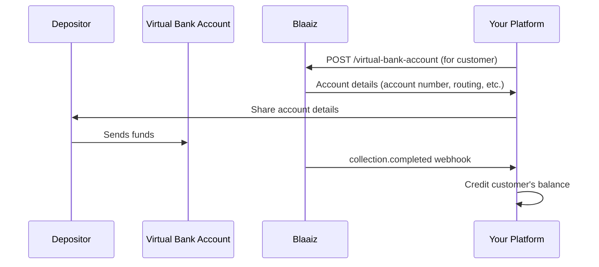

Issue dedicated Virtual Bank Accounts to your customers so they can receive funds directly. When money arrives, Blaaiz credits the associated wallet and sends you a webhook — no manual reconciliation needed.

## How it works

## Step-by-step

1. **Verify the customer** — [Create a customer](/api-reference/customer/create) with full KYC (required for GBP, EUR, and USD accounts).
2. **Create the Virtual Bank Account** — Call [Create Virtual Bank Account](/api-reference/virtual-bank-account/create) with the customer's `wallet_id` and `customer_id`. For NGN, the account activates instantly. For GBP, EUR, and USD, listen for the [`virtual_account.ready`](/guides/webhooks/virtual-account) webhook.
3. **Share details with your customer** — Display the account number, routing number (USD), sort code (GBP), or IBAN (EUR) in your UI.
4. **Handle deposits** — When funds arrive, Blaaiz sends a `collection.completed` webhook with the amount, sender information, and Virtual Bank Account ID.
5. **Credit your customer** — Use the webhook data to update the customer's balance in your system.

## Supported currencies

| Currency | Account type | Activation |
|----------|-------------|------------|
| NGN | Local bank account | Instant |
| USD | ACH account + routing number | Async (webhook) |
| GBP | UK sort code + account number | Async (webhook) |
| EUR | SEPA IBAN + BIC | Async (webhook) |

<Note>
Each customer can have one Virtual Bank Account per currency. Use the [Get identification type](/api-reference/virtual-bank-account/get-identification-type) endpoint to determine what TIN label to display in your UI based on the customer's country.
</Note>

## APIs used

- [Create customer](/api-reference/customer/create)
- [Create Virtual Bank Account](/api-reference/virtual-bank-account/create)
- [Get identification type](/api-reference/virtual-bank-account/get-identification-type)
- [Webhook events](/guides/webhooks/events)
